# TenderIntel

**Enterprise Competitive Intelligence Platform for Government Procurement**

TenderIntel is a production-ready competitive intelligence platform designed to provide comprehensive visibility into government procurement activities. The system enables organizations to identify competitive opportunities, analyze market dynamics, and track competitor performance across government contracting sectors.

[](https://www.python.org/downloads/)
[](https://opensource.org/licenses/MIT)
[](https://fastapi.tiangolo.com)
[](https://www.docker.com/)

---

## Executive Summary

### Business Challenge

Government procurement portals impose significant constraints on search functionality that limit effective tender discovery. Common issues include:

- Minimum character requirements that prevent searching for technical acronyms (e.g., "API" rejected for being too short)
- Keyword matching limitations that return irrelevant results
- Lack of semantic understanding resulting in poor search relevance

### Solution Overview

**Traditional Government Portal Search:**

```
Search: "API"
  ↓
Results:
• Application Form #1234
• Applicant Registration
• Apply for Tender
• Application Portal
• API → Too Short (min 4 chars)
  ↓
Time: Hours of manual filtering
Relevance: Approximately 10%
```

**TenderIntel Intelligent Search:**

```
Search: "API"
  ↓
Expands to:
• Application Programming Interface
• REST API
• API Gateway
• OpenAPI
• API Management
  ↓
Results:
• REST API Gateway Project - NIC
• API Integration Services - MEITY
• OpenAPI Platform Development
• Microservices API - DIC
  ↓
Time: 1.54 milliseconds
Relevance: 100%
```

**Key Capabilities:**

- Automated semantic expansion of 266+ technical keywords across 29 domains
- Sub-millisecond search performance with full-text indexing
- Multi-dimensional filtering across 8 distinct categories
- Comprehensive competitive intelligence tracking across 38 government organizations
- Real-time market analysis covering ₹3.37 billion in procurement value

---

## Installation and Quick Start

### Windows Deployment

```powershell
# Open PowerShell as Administrator and run:
git clone https://github.com/tenderintel/tenderintel.git
cd TenderIntel
.\scripts\setup\setup_windows.ps1

# That's it! Everything installs automatically.
# Open http://localhost:8080 when it's done.
```

### Docker Deployment

```bash
# One command, works everywhere:
git clone https://github.com/tenderintel/tenderintel.git
cd TenderIntel
docker-compose up -d

# Open http://localhost:8080 
```

### Traditional Installation (Linux/macOS)

```bash
git clone https://github.com/tenderintel/tenderintel.git
cd TenderIntel
pip install -e ".[tenderx]"
python scripts/setup/initialize_project.py
python -m uvicorn src.tenderintel.api.server:app --port 8002
```

**Verification:**
```bash
curl "http://localhost:8002/search?q=cloud"
```

---

## Core Functionality

### Intelligent Search Capabilities

Advanced semantic search designed to overcome government portal limitations:

- **Technical Term Expansion**: "lan" automatically expands to find all Local Area Network tenders (excludes land development projects)
- **Acronym Resolution**: "api" expands to REST API, API Gateway projects (excludes application forms)  
- **Domain-Specific Intelligence**: "waf" identifies Web Application Firewalls (filters non-relevant acronyms)

**Search Dictionary**: 266+ technical keywords automatically expanded across 29 domains.

### Competitive Intelligence

Comprehensive market tracking capabilities:

- **Organization Monitoring**: 38 government entities tracked across procurement activities
- **Service Categorization**: 11 distinct service categories (Cloud, Networking, Security, etc.)
- **Market Value Analysis**: ₹3.37 billion in total market value analyzed
- **Real-time Analytics**: Competitive positioning and market share analysis

### Advanced Filtering System

8 independent filter dimensions that can be combined:

1. **Service Categories** - Cloud, Networking, Security, and additional domains
2. **Deal Value** - ₹10 Lakh, ₹1 Crore, ₹5 Crore+ (Indian formatting)
3. **Geographic Regions** - Northern, Southern, Eastern, Western, Central India
4. **Organizations** - Search through 38 government entities
5. **Tender Status** - Published, Live, or Closed
6. **Department Type** - Central or State Government
7. **Complexity** - Simple, Moderate, or Complex projects
8. **Date Range** - Filter by Award of Contract dates

### Business Intelligence Dashboards

- **Executive Dashboard**: Market overview with KPIs and trends
- **Service×Firm Heatmap**: Competitive positioning by service category
- **Geographic Analysis**: Regional procurement activity mapping
- **Financial Analytics**: Multi-currency conversion and deal benchmarking

---

## Technical Differentiators

### Performance Characteristics

Search 114 tenders in 1.54 milliseconds with real-time filtering and analysis.

### Production Readiness

18 API endpoints, fully tested and documented. 100% frontend functionality verification.

### Deployment Flexibility

Cross-platform support: Windows (automated deployment), macOS, Linux, and Docker containerization.

---

## System Performance Metrics

```
Performance Benchmarks (Measured, Not Estimated)
═══════════════════════════════════════════════

Search Speed        │████████████████░░│  1.54ms  ⚡ Blazing
Filter Search       │████████████████░░│  1.69ms  ⚡ Blazing  
Keyword Expansion   │███████████████░░░│  <1ms    ⚡⚡ Lightning
API Health Check    │████████████████░░│  <5ms    ⚡ Fast
Database Queries    │████████████████░░│  <5ms    ⚡ Fast
Analytics APIs      │██████████░░░░░░░░│  <50ms   ✓ Good
Visualization APIs  │████░░░░░░░░░░░░░░│  <100ms  ✓ Acceptable

Current System Stats
────────────────────
📊 Database: 114 tender records
🔧 APIs: 18 endpoints (100% functional)
🎯 Keywords: 266+ technical terms  
💻 Frontend: 13 JS files, 950+ lines
✅ Tests: 100% success rate
🏢 Organizations: 38 government entities
💰 Market Value: ₹3.37B analyzed
```

---

## System Architecture

### Architecture Overview


### Search Intelligence Flow

```mermaid
graph LR
    A[User Searches: API] --> B{Keyword Expansion}
    B -->|266+ Dictionary| C[8 Variations Found]
    C --> D[REST API<br/>API Gateway<br/>OpenAPI<br/>...]
    D --> E{FTS5 Search}
    E -->|114 Records| F[Relevant Results]
    F --> G[Sort by Relevance]
    G --> H[Return in 1.54ms ⚡]
    
    style A fill:#e1f5ff
    style C fill:#d4edda
    style H fill:#d4edda
```



### REST API Architecture

18 API Endpoints - Complete REST Interface

```mermaid
graph TD
    A[TenderIntel API] --> B[📡 System APIs]
    A --> C[🔍 Search APIs]
    A --> D[📊 Intelligence API]
    A --> E[📈 Analytics APIs]
    A --> F[📊 Visualization APIs]
    A --> G[🏭 Scraper API]
    A --> H[🧪 Testing API]
    
    B --> B1[GET /]
    B --> B2[GET /health]
    B --> B3[GET /stats]
    
    C --> C1[GET /search]
    C --> C2[GET /search-filtered]
    C --> C3[GET /expand]
    C --> C4[GET /filter-options]
    C --> C5[GET /faceted-search]
    
    D --> D1[GET /competitive-intelligence/summary]
    
    E --> E1[GET /analytics/firm-scorecard/]
    E --> E2[GET /analytics/market-analysis/]
    E --> E3[GET /analytics/deal-benchmarking]
    E --> E4[POST /analytics/normalize-currency]
    
    F --> F1[GET /visualizations/heatmap-data]
    F --> F2[GET /visualizations/geographic-data]
    F --> F3[GET /visualizations/executive-summary]
    
    G --> G1[POST /scraper/cppp]
    
    H --> H1[GET /test-demo-scenarios]
    
    style A fill:#e8eaf6
    style B fill:#e3f2fd
    style C fill:#e1f5fe
    style D fill:#f3e5f5
    style E fill:#fce4ec
    style F fill:#fff3e0
    style G fill:#f1f8e9
    style H fill:#efebe9
```



### Data Enhancement Pipeline

```mermaid
graph LR
    subgraph Input["📥 Raw Government Data"]
        A1[Title: LAN Setup]
        A2[Org: NIC]
        A3[Value: ₹5L]
        A4[Date: 2025-01-20]
    end
    
    subgraph Enhancement["🔧 TenderIntel Enhancement"]
        B1[Keyword Expansion]
        B2[Service Categorization]
        B3[Complexity Assessment]
        B4[Geographic Mapping]
    end
    
    subgraph Output["📊 Actionable Intelligence"]
        C1[✓ Service: Networking]
        C2[✓ Category: Infrastructure]
        C3[✓ Region: Delhi]
        C4[✓ Complexity: Medium]
        C5[✓ Keywords: LAN, Ethernet, Switch]
    end
    
    Input -->|Process| Enhancement
    Enhancement -->|Enrich| Output
    
    B1 -.->|Local Area Network<br/>Ethernet<br/>Switches| C5
    
    style Input fill:#ffebee
    style Enhancement fill:#e8f5e9
    style Output fill:#e3f2fd
```



### Frontend Interface

Professional web interface built with Alpine.js and TailwindCSS:

**Advanced Search Page**
- Professional search bar with example keywords
- 8 filter categories with real-time updates
- Interactive similarity slider (0-100%)
- Results table with sorting and pagination
- Export to CSV functionality
- Saved searches and history

**Executive Dashboard**  
- Market value and competitor count
- Service category breakdown
- Recent activity feed
- Top performing organizations

**Intelligence Heatmap**
- Service×Firm competitive matrix
- Interactive cells with drill-down
- Multiple metric views (share, count, value)

All interfaces are mobile-responsive and fully tested.

### Database Architecture

SQLite with FTS5 (full-text search) and a sophisticated 33-field schema:

**Basic Info:** Title, organization, status, dates, URLs  
**Financial Data:** Award values, currencies, deal classifications  
**Competitive Intel:** Winning firms, bidder counts, margins  
**Geographic:** States, cities, regions, coordinates  
**Search Optimized:** Porter stemming, prefix matching for short terms

---

## Technology Stack

**Backend:** Python + FastAPI + SQLite FTS5  
**Frontend:** Alpine.js + TailwindCSS (no build step)  
**Scraping:** Selenium + Tesseract OCR + enhanced CAPTCHA handling  
**Deployment:** Docker Compose with Nginx  
**Testing:** Comprehensive validation (18 API tests, frontend tests)  

**Technology Selection Rationale:**
- FastAPI: High performance, modern framework, comprehensive documentation
- Alpine.js: Reactive frontend without build complexity  
- SQLite FTS5: Production-grade search without PostgreSQL infrastructure requirements
- Docker: Platform-independent deployment capability

---

## Target Use Cases

**Recommended For:**
- Organizations tracking competitors in government procurement
- Teams requiring rapid tender discovery capabilities
- Analysts needing market dynamics and trend analysis
- Procurement teams analyzing patterns by region or category
- Business development teams requiring competitive intelligence

**Alternative Solutions May Be Preferable For:**
- Simple tender notification requirements only
- Organizations not requiring competitive analysis
- Entities tracking 1-2 specific organizations only
- Users not requiring technical search capabilities

---

## Deployment Architecture

### Deployment Method Selection

```mermaid
graph TD
    Start[🚀 Choose Deployment Method] --> Q1{What's Your Platform?}
    
    Q1 -->|Windows| W[💻 Windows PowerShell]
    Q1 -->|Docker Available| D[🐳 Docker Compose]
    Q1 -->|Linux/macOS| L[🐧 Python venv]
    
    W -->|Run Script| W1[.\scripts\setup\setup_windows.ps1]
    W1 --> W2[⏱️ 5 minutes<br/>✅ Fully Automatic<br/>✅ Installs Dependencies]
    
    D -->|One Command| D1[docker-compose up -d]
    D1 --> D2[⏱️ 3 minutes<br/>✅ Cross-Platform<br/>✅ Isolated Environment]
    
    L -->|Traditional Setup| L1[pip install -e .[tenderx]]
    L1 --> L2[⏱️ 5 minutes<br/>✅ Full Control<br/>✅ Development Ready]
    
    W2 --> Success[✅ Ready!<br/>http://localhost:8080]
    D2 --> Success
    L2 --> Success
    
    style Start fill:#e8eaf6
    style W fill:#e1f5fe
    style D fill:#e0f2f1
    style L fill:#f3e5f5
    style Success fill:#c8e6c9
```

### Recommended: Docker Deployment
One command deployment with cross-platform compatibility:
```bash
docker-compose up -d
```

### Windows: Automated Installation
Fully automated installation with all dependencies:
```powershell
.\scripts\setup\setup_windows.ps1
```

### Traditional: Python Virtual Environment
Standard Python development workflow with complete control:
```bash
pip install -e ".[tenderx]"
python scripts/setup/initialize_project.py
```

All deployment methods have been tested and validated.

---

## Documentation

Comprehensive documentation is available for all user types:

**New Users:** Read [`docs/INSTALLATION.md`](docs/INSTALLATION.md) - Complete installation walkthrough

**End Users:** Check [`docs/USER_MANUAL.md`](docs/USER_MANUAL.md) - Real examples and workflows

**Developers:** See [`docs/API_REFERENCE.md`](docs/API_REFERENCE.md) - All 18 endpoints documented

**DevOps:** Read [`docs/DEVELOPER_GUIDE.md`](docs/DEVELOPER_GUIDE.md) - Architecture and scaling considerations

---

## Usage Examples

### Example: API-Related Tender Discovery

Step 1: Keyword Expansion
```bash
curl "http://localhost:8002/expand?q=api"
```

**Returns:** `["application programming interface", "rest api", "api gateway", "openapi", "api management"]`

Step 2: Search Execution
```bash
curl "http://localhost:8002/search?q=api&limit=10"
```

**Returns:** 10 relevant tenders in 1.54ms, excluding application forms

Step 3: Filtered Search
```bash
curl "http://localhost:8002/search-filtered?q=api&service_categories=cloud&value_ranges=10000000-50000000"
```

**Returns:** Cloud API projects worth ₹1-5 Crores

This demonstrates the intelligent search capability that distinguishes TenderIntel from traditional government portals.

---

## System Status

**Production Readiness:** Verified, all systems tested  
**API Endpoints:** 18/18 operational (100%)  
**Frontend Interface:** Fully functional with 8 filters  
**Database:** 114 tender records indexed and searchable  
**Performance:** Sub-2ms search response times verified  

**Last Tested:** October 22, 2025  
**Test Results:** [`COMPREHENSIVE_API_TEST_REPORT.md`](COMPREHENSIVE_API_TEST_REPORT.md)

---

## Contributing

Contributions are welcome in the following areas:

**Enhancement Opportunities:**
- Additional keywords for the 266+ expansion dictionary
- Improved CAPTCHA solving accuracy
- Additional government portal integrations  
- Enhanced analytics features
- Documentation and example improvements

See [`CONTRIBUTING.md`](CONTRIBUTING.md) for contribution guidelines.

---

## Support Resources

**Installation Issues:** See [`docs/INSTALLATION.md`](docs/INSTALLATION.md) - comprehensive troubleshooting

**Functionality Questions:** Check [`docs/USER_MANUAL.md`](docs/USER_MANUAL.md) - step-by-step guides

**API Documentation:** Browse http://localhost:8002/docs - interactive documentation

**Issue Reporting:** https://github.com/tenderintel/tenderintel/issues

**Email Contact:** team@tenderintel.org

---

## License

MIT License - use for commercial projects, modification, and distribution permitted. See [LICENSE](LICENSE) for complete terms.

---

## Acknowledgments

**TenderX Project** - Foundation CPPP scraping infrastructure  
**Government Portals** - CPPP and GeM data sources  
**Open Source** - FastAPI, SQLite, Alpine.js, TailwindCSS  
**Community** - Users and contributors supporting TenderIntel development  

---

**Getting Started:**

**Quick Start:** `curl "http://localhost:8002/search?q=cloud"`  
**Installation Guide:** [`docs/INSTALLATION.md`](docs/INSTALLATION.md)  
**Discussion Forum:** https://github.com/tenderintel/tenderintel/discussions
